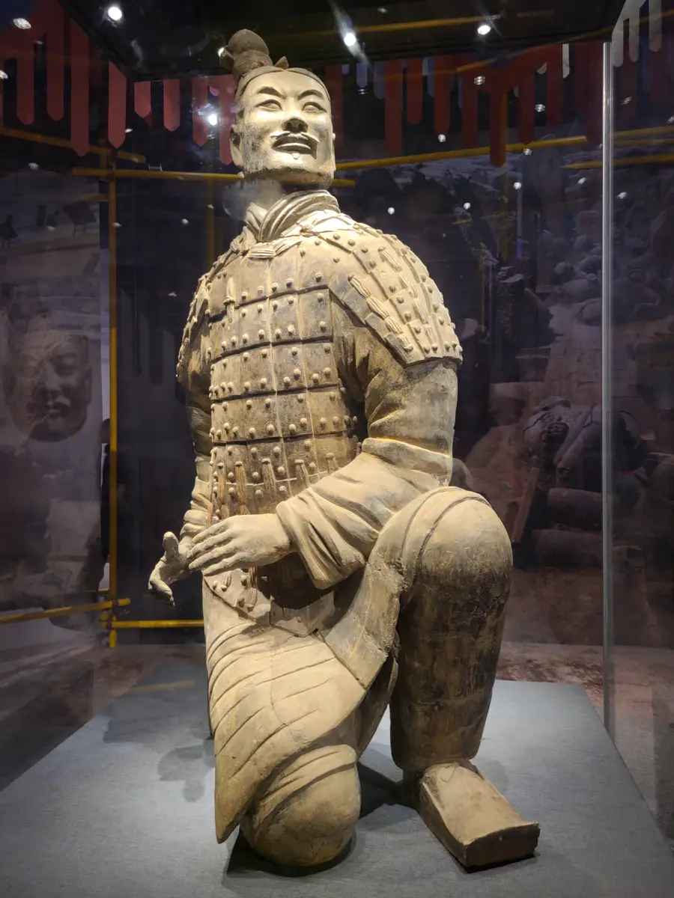
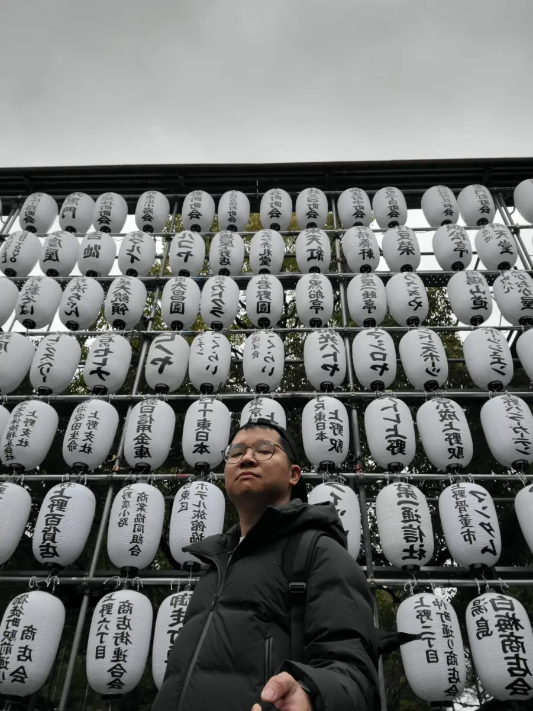
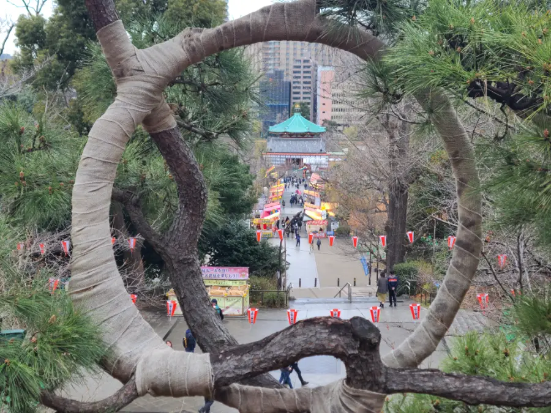
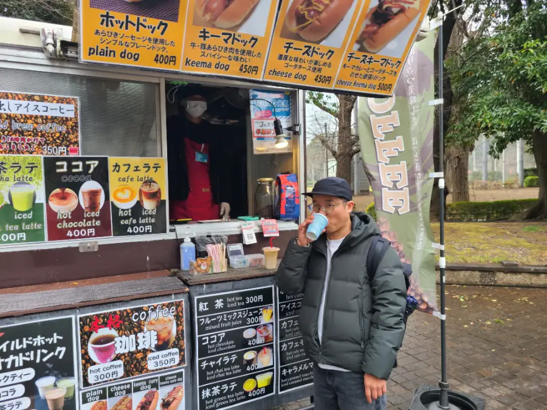
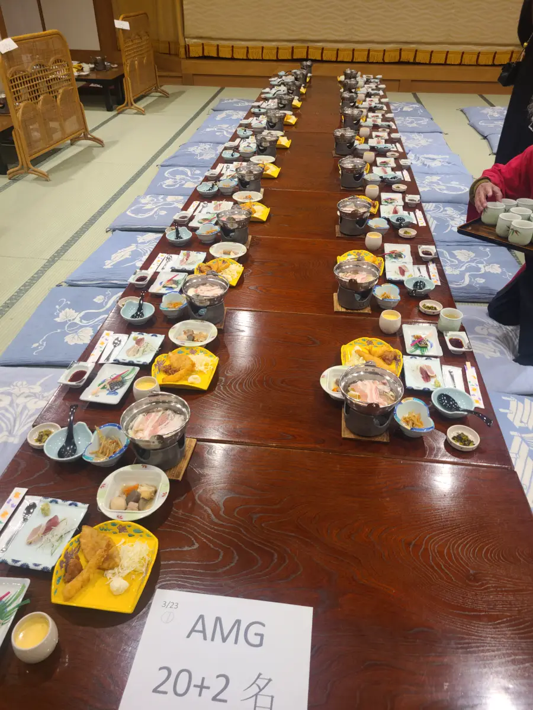
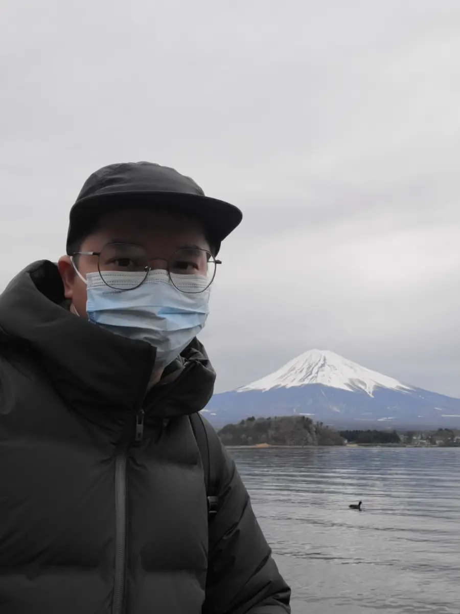
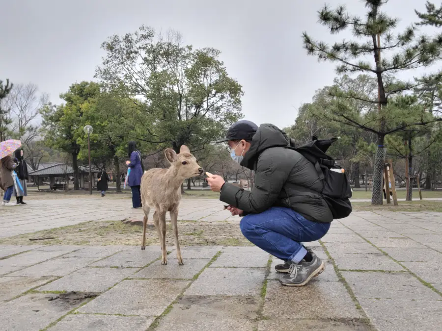
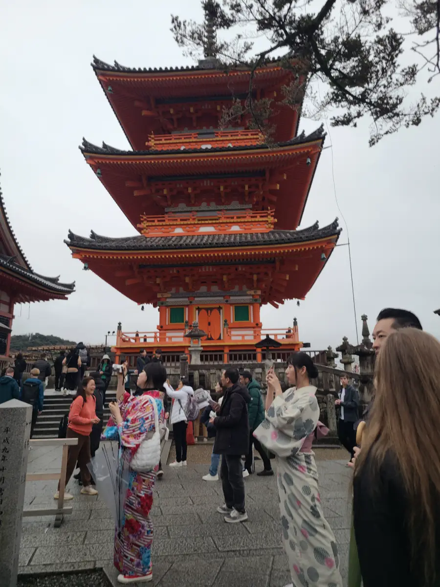

# 第一篇博客

>今年对我来说真的是特别的一年，第三个本命年，然后又遇上了裁员。
>对于一个三十多岁的程序员来说，想要通过再就业也许是一件不太容易的事了，所以在这空档的时间里面，我给自己多放了一些假期，给自己好好休息。也许是实在没什么事可以做，才开始写我的博客，之前实在是懒了。

# 日本旅游
最近的大半年时间里我出去玩的时间占了比较多，过年期间去了一趟西安，过年回来之后就收到了被裁员的通知，然后就开始了我的自由职业生涯。

过年在西安没做什么，就是逛逛吃吃，走走看看，最让我震撼的还是去看秦始皇兵马俑，两千多年前的古人，真的充满了智慧。

裁员后去的第一个地方就是日本，日本是一个我一直都很想去的国家，当然也是我第一次出国。

日本给我的感觉就是真的很干净，最震惊的是，连货车都干净非常干净。很可惜的一点就是，去的时候樱花开得非常少，而且那几天天气还非常差，又下雨。

尝试跪着吃的日本团餐。

看了最值得一看的富士山，富士山真的长得特别不一样，很对称，很美的一座雪山。

去奈良看了小鹿，这个时候也不是看小鹿的最佳时间，小鹿都在换毛，不过还是很可爱。

看看京都的建筑

# 未来
我在到处玩了一段时间后，我的膝盖老毛病开始有点痛了，可能是走太多了，所以就选择先回老家休息一段时间。不料在老家真的过得比在深圳要舒服得多，每天睡到自然醒，吃的也很好。

后来发现我好像越来越懒了，我必须要让自己忙起来才行，这样我才不至于感觉到无所事事。
